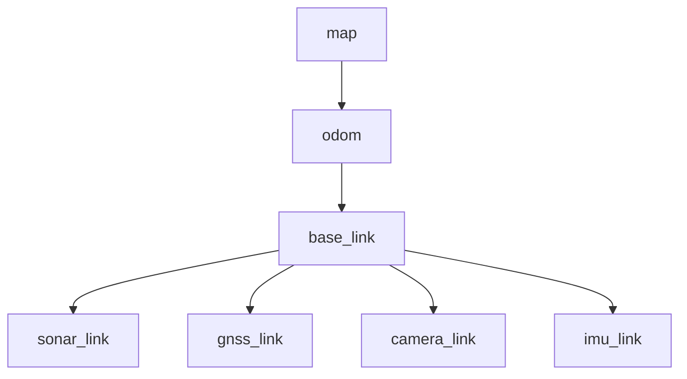
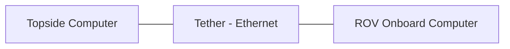

# Communication

This page maps the ROS2 communication interfaces (topics, services, and actions) used by mr_pinchy.

## Topics

!!! note
    This table will grow as packages are integrated. Document each topic as it is established.

| Topic | Message Type | Publisher | Subscriber(s) | Rate | Description |
|-------|-------------|-----------|---------------|------|-------------|
| `/sonar/ranges` | TBD | waterlinked_sonar_3d15 | Perception | TBD | Sonar range measurements |
| `/gnss/fix` | `sensor_msgs/NavSatFix` | ublox_dgnss | Localization | TBD | GNSS position fix |
| `/gnss/heading` | TBD | ublox_dgnss | Localization | TBD | Dual-antenna heading |
| `/cmd_vel` | `geometry_msgs/Twist` | Controller | Thruster allocator | TBD | Velocity commands |
| `/imu/data` | `sensor_msgs/Imu` | TBD | Localization | TBD | IMU readings |

## Services

| Service | Type | Server | Description |
|---------|------|--------|-------------|
| TBD | TBD | TBD | TBD |

## Actions

| Action | Type | Server | Description |
|--------|------|--------|-------------|
| TBD | TBD | TBD | TBD |

## TF Tree

The transform tree defines the spatial relationships between coordinate frames on the vehicle.

!!! note
    Update the TF tree as sensor frames are defined and static transforms are calibrated.

## Network Topology

The topside computer and ROV communicate over Ethernet through the tether. ROS2 DDS discovery operates across this link, allowing nodes on either machine to communicate transparently.
