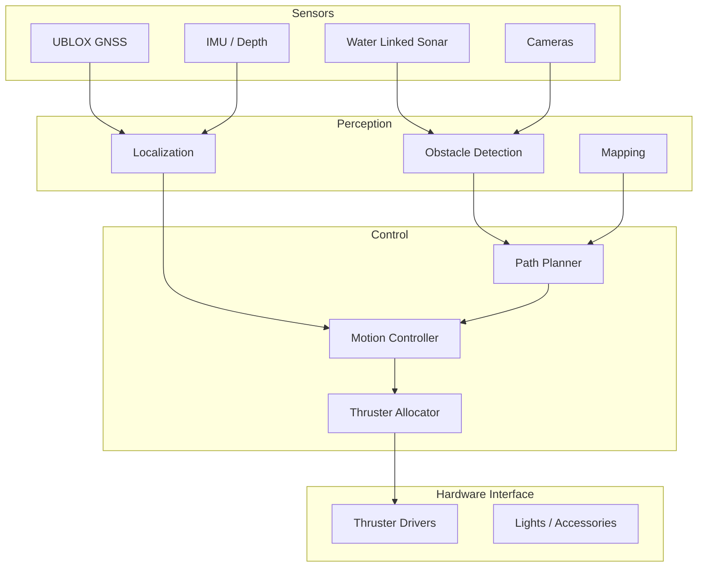

# System Architecture

This section describes the high-level software architecture of mr_pinchy.

## Design Principles

- **Modular:** Each capability (drivers, perception, control) lives in its own ROS2 package
- **Decoupled:** Packages communicate via well-defined ROS2 interfaces (topics, services, actions)
- **Testable:** Individual components can be tested in isolation or with simulated inputs
- **Incremental:** Start with teleoperation, progressively add autonomous behaviors

## High-Level Architecture

## Layers

| Layer | Responsibility | Examples |
|-------|---------------|----------|
| **Drivers** | Hardware abstraction, raw data publishing | Sonar driver, GNSS driver, thruster interface |
| **Perception** | Sensor fusion, state estimation, environment modeling | Localization, obstacle detection, mapping |
| **Control** | Decision making, motion control | Path planning, PID controllers, thruster allocation |
| **Mission** | High-level task execution | Waypoint following, survey patterns |

## Further Reading

- [ROS2 Workspace](ros2-workspace.md) — package layout and build structure
- [Communication](communication.md) — topics, services, and actions map
