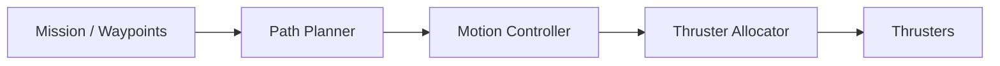

# Control

The control stack is responsible for translating high-level commands into thruster outputs that move mr_pinchy through the water.

## Overview

## Control Layers

| Layer | Input | Output | Description |
|-------|-------|--------|-------------|
| **Mission** | Operator commands / autonomy goals | Waypoints / paths | High-level task definition |
| **Path Planner** | Waypoints + obstacle map | Desired trajectory | Collision-free path generation |
| **Motion Controller** | Desired vs. actual state | Body-frame forces/torques | PID or model-based control |
| **Thruster Allocator** | Forces/torques | Individual thruster commands | Maps desired wrench to thruster PWM |

## BlueROV2 Thruster Configuration

The BlueROV2 uses 6 thrusters in a vectored configuration:

- 4 horizontal thrusters (angled at 45 degrees) for surge, sway, and yaw
- 2 vertical thrusters for heave

This configuration provides control authority in all 6 degrees of freedom (surge, sway, heave, roll, pitch, yaw), though roll and pitch authority is limited.

## Degrees of Freedom

| DOF | Axis | Actuated By |
|-----|------|-------------|
| Surge | Forward/backward | Horizontal thrusters |
| Sway | Left/right | Horizontal thrusters |
| Heave | Up/down | Vertical thrusters |
| Roll | Rotation about forward axis | Limited (thruster placement) |
| Pitch | Rotation about lateral axis | Limited (thruster placement) |
| Yaw | Rotation about vertical axis | Horizontal thrusters |

## Control Modes

!!! note
    Document control modes as they are implemented.

Planned control modes:

- **Manual:** Direct thruster commands from operator joystick
- **Stabilized:** Attitude and depth hold with manual surge/sway/yaw
- **Depth hold:** Automatic depth regulation
- **Heading hold:** Automatic heading regulation
- **Station keeping:** Hold position and heading
- **Waypoint following:** Navigate to commanded waypoints

## Future Work

- Model-based control using vehicle hydrodynamics
- Adaptive control for varying payload configurations
- Integration with perception for reactive obstacle avoidance
