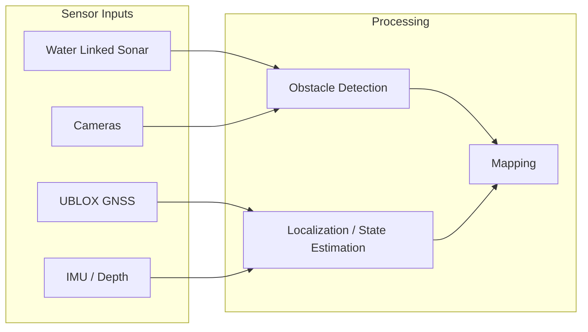

# Perception

The perception stack is responsible for understanding the environment around mr_pinchy — detecting obstacles, estimating position, and building maps.

## Overview

## Sensor Packages

| Sensor | Package | Status |
|--------|---------|--------|
| Water Linked Sonar 3D15 | [waterlinked_sonar_3d15](https://github.com/PinchyFamily/waterlinked_sonar_3d15) | Available |
| UBLOX GNSS (ZED-F9P) | [ublox_dgnss](https://github.com/PinchyFamily/ublox_dgnss) | Available |
| Cameras | TBD | Planned |
| IMU / Depth | TBD | Planned |

## Capabilities

### Obstacle Detection

!!! note
    Document obstacle detection approach as it is developed — sonar-based range gating, camera-based detection, fusion strategies.

### Localization

!!! note
    Document state estimation approach — GNSS for surface, IMU/DVL for subsurface, EKF/UKF fusion.

### Mapping

!!! note
    Document mapping strategy as it is developed — occupancy grids, point clouds, terrain models.

## Future Work

- Sensor fusion between sonar and camera data
- Underwater SLAM (Simultaneous Localization and Mapping)
- Terrain-relative navigation for GPS-denied subsurface operation
